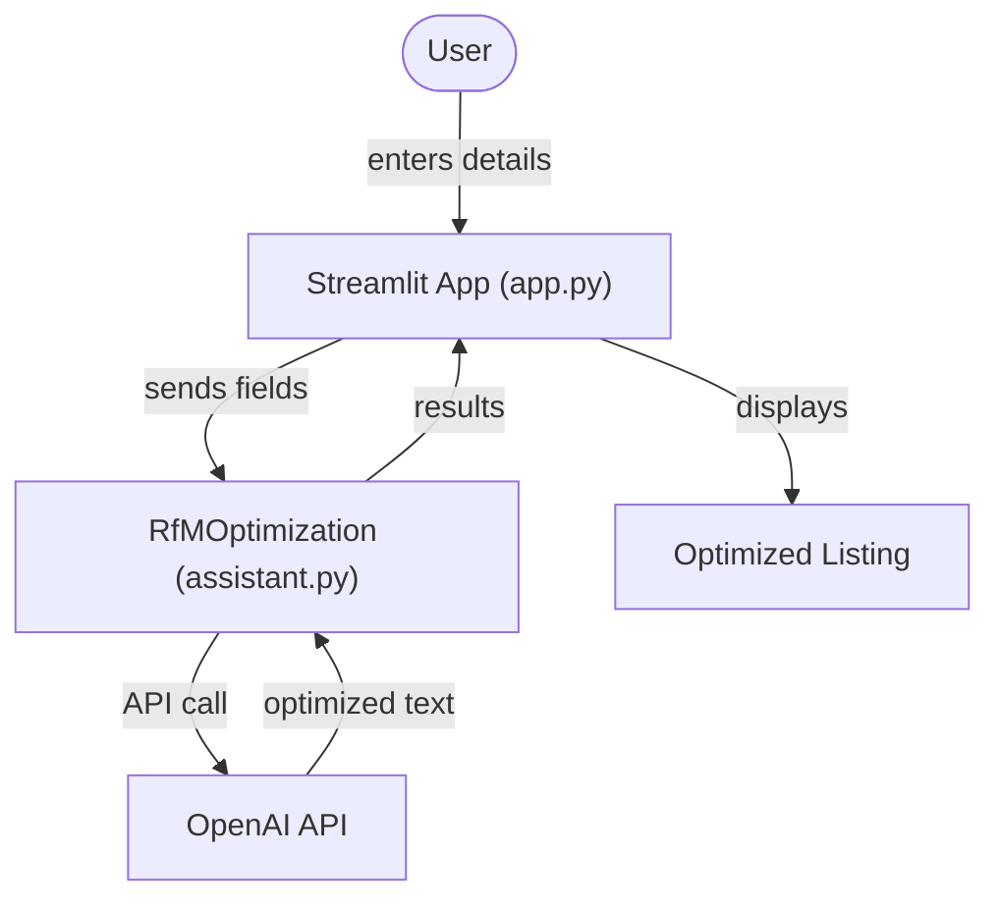

# rfm-optimization-assistant: Python Package Overview

This package helps you optimize research study listings for the Research for Me (RfM) platform. It uses OpenAI's language models to rewrite your study details in clear, plain language. The package includes a Streamlit web app for easy use.

## Table of Contents

- [Project Structure](#project-structure)
- [Main Components](#main-components)
- [How It Works](#how-it-works)
- [References](#references)

## Project Structure

The package has these main files:

- `app.py`: The Streamlit web app. Users enter study details and get optimized text.
- `assistant.py`: Defines the `RfMOptimization` class. Handles text optimization for each field.
- `connect.py`: Checks OpenAI API connection and model availability.
- `__init__.py`: Exports key functions and classes for easy import.

## Main Components

### `connect.py`

- Function: `connect_openai(model, version)`
    - Checks if the OpenAI API key is set and if the model is available.
    - Returns connection info or raises an error if not connected.

### `assistant.py`

- Class: `RfMOptimization`
    - Attributes:
        - `study_title`, `purpose`, `pitch`, `participant_tasks`, `compensation`
    - Methods:
        - `__init__`: Sets up the class and checks OpenAI connection.
        - `optimize(text, field_type)`: Sends text to OpenAI and gets a plain language rewrite.
        - `generate_optimized_listing()`: Optimizes all fields and returns results as a dictionary.

### `__init__.py`

- Makes `connect_openai` and `RfMOptimization` available for import.
- Sets the package version.

### `app.py`

- The main web interface. Users paste their study details and click "Optimize!".
- Calls `RfMOptimization` to process each field.
- Shows optimized text for each field.

## How It Works

1. The user opens the web app (`app.py`) and enters study details.
2. When the user clicks "Optimize!", the app creates an `RfMOptimization` object.
3. The class checks the OpenAI API connection using `connect_openai`.
4. For each field, the app sends the text to OpenAI and gets a plain language rewrite.
5. The app displays the optimized text for each field.

## References

- OpenAI API Documentation: https://platform.openai.com/docs/api-reference
- Streamlit Documentation: https://docs.streamlit.io/library
- Python Packaging Authority: https://packaging.python.org/
