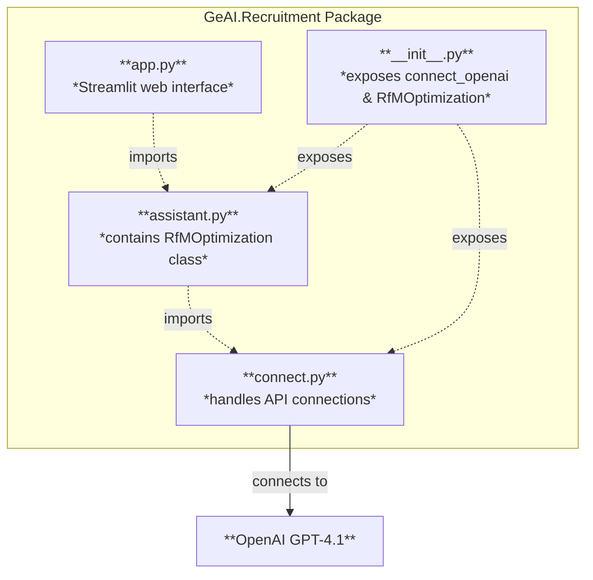

# Ali's Research for Me @ UNC Listing Optimization Web Application: Modules and Functions

This document outlines the main components of my app, which is designed to
optimize Research for Me (RfM) study listings more efficiently than our previous
workflow. It explains how each part fits together, making it easier to
understand, identify reusable modules, and prepare the project for deployment.

## Table of Contents

- [Project Structure](#project-structure)
- [Module Overview: The Puzzle Pieces](#module-overview)
    - [`connect.py`](#connectpy)
    - [`assistant.py`](#assistantpy)
    - [`__init__.py`](#initpy)
    - [`app.py`](#apppy)
- [How the Pieces Fit Together](#how-the-pieces-fit-together)
- [References](#references)

## Project Structure

My app is organized as a Python package called `GeAI.Recruitment`, with the
following key files:

- `__init__.py`: Defines the package's API, classes, and version.
- `connect.py`: Handles connecting to OpenAI's generative pre-trained
    transformer (GPT-*n* series) and checking model availability.
- `assistant.py`: Contains the `RfMOptimization` class for optimizing
    recruitment listings.
- `app.py`: Contains the frontend Streamlit web application for user interaction
    and displaying results.

## Module Overview

### `connect.py`

- Functions: `connect_openai(model, version)`
    - Connects to OpenAI via an API, checks if a GPT model is available, and
        returns connection information.
    - Handles API key management securely and checks for error conditions.

### `assistant.py`

- Class: `RfMOptimization`
    - Attributes:
        - `studytitle`, `purpose`, `pitch`, `participant_tasks`, `compensation`
    - Methods:
        - `__init__`: Initializes the class with study details and connects to
            OpenAI.
        - `optimize(text, field_type)`: Uses AI to rewrite text for a specific
            field (e.g., study title, study purpose) to improve engagement.
        - `generate_optimized_listing()`: Optimizes all non-empty fields and
            returns results as a dictionary.

### `__init__.py`

- Exposes `connect_openai` and `RfMOptimization` for easy import.
- Sets the package version and controls what is available when the package is
    imported with `from GeAI.Recruitment import *`.

### `app.py`

- This is the main Streamlit web interface users interact with. It allows users
    to input study details and get optimized recruitment text.
- Basic flow:
    - Collects user input for each field.
    - On the "Optimize" button click, it creates an `RfMOptimization` object and
        calls `generate_optimized_listing()`.
    - Displays the optimized text for each non-empty field.

## How the Pieces Fit Together

- The web app, or what users see, is in `app.py`. It serves as the entry point
    for users.
- It uses the `RfMOptimization` class from `assistant.py` to process and
    optimize text fields the user provides.
    - This class, in turn, relies on the `connect_openai` function from
        `connect.py` to interact with OpenAI's API.
- The `__init__.py` file makes these components easily accessible as part of a
    unified package called `GeAI.Recruitment`.

## References

- GeAI GitHub Repository: https://genai.gd.edu.kg/python/
- OpenAI API Documentation: https://platform.openai.com/docs/api-reference
- Streamlit Documentation: https://docs.streamlit.io/library
- Python Packaging Authority: https://packaging.python.org/
