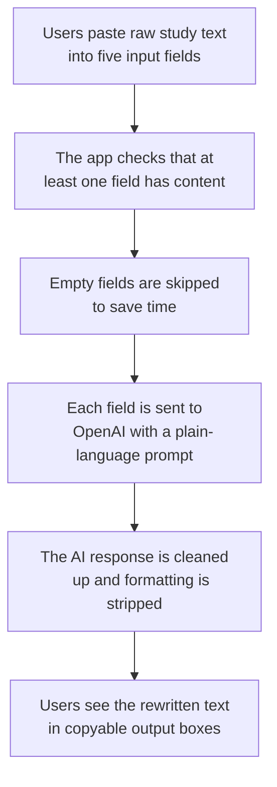
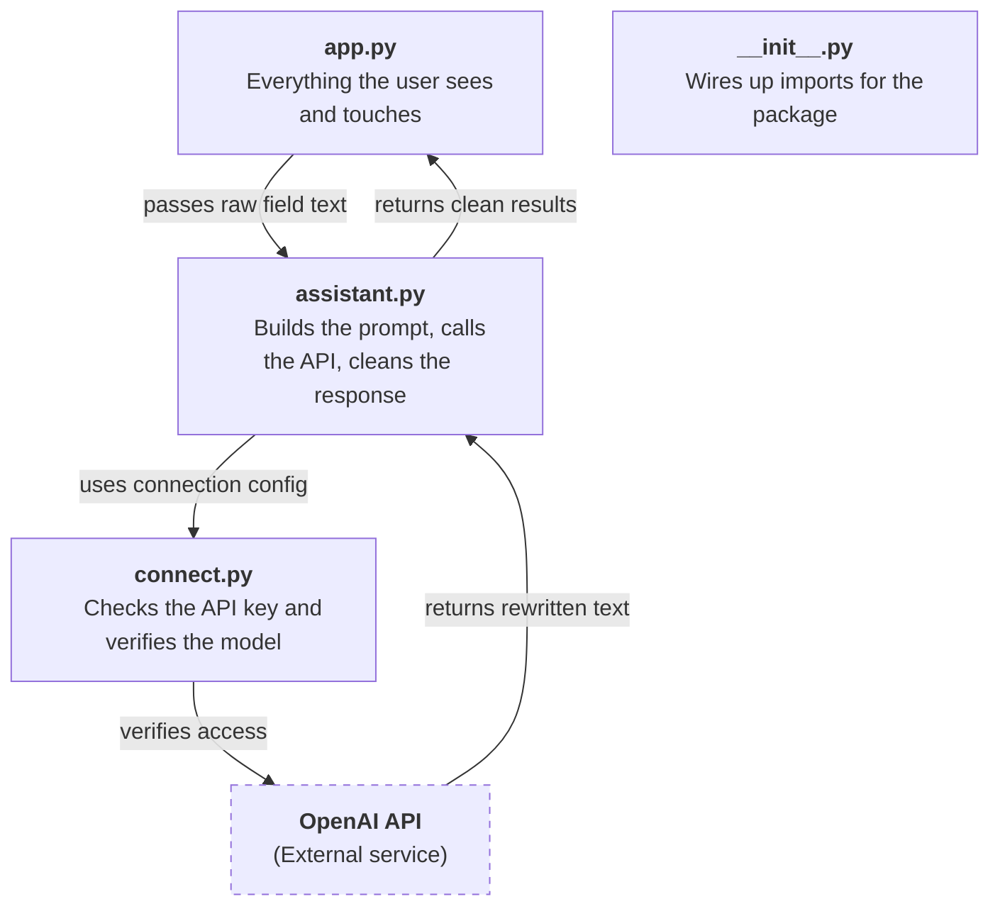

# RfM Optimization Assistant

A simple web app that rewrites research study listings in plain language. Paste your study details, click a button, and get clear text that anyone can understand.

## What This App Does

Study teams often write study listings full of clinical terms, long sentences, and what I like to call "grant speak." This makes it hard for everyday people in our communities to understand what a study is about and why they should join.

This web application fixes that. It takes original study text and uses AI to rewrite it in short, friendly, plain language. The result is something study teams can incorporate directly into their study materials. This particular app is designed to support the Research for Me (RfM) study listing optimization process for the Recruitment & Retention (R&R) program at the North Carolina Translational and Clinical Sciences (NC TraCS) Institute. However, the code is open source and can be adapted for other use cases.

The app rewrites five fields:

- **Short study title** — a clear, engaging name for the study.
- **Study purpose** — why this research matters, in terms people care about.
- **Recruitment pitch** — a personal, compelling reason to participate.
- **Participant tasks** — what taking part actually looks like, step by step.
- **Compensation** — what participants get, with clear amounts and timing.

## How It Works

The app follows a straight line from user input to polished output. Here is what happens at each step:


```mermaid
flowchart TD
    A["Users paste raw study text
    into five input fields"] --> B["The app checks that at
    least one field has content"]
    B --> C["Empty fields are skipped
    to save time"]
    C --> D["Each field is sent to
    OpenAI with a plain-language prompt"]
    D --> E["The AI response is cleaned
    up and formatting is stripped"]
    E --> F["Users see the rewritten text
    in copyable output boxes"]
```

In plain terms:

1. Users open the app and paste their study details into the input fields.
2. Users click the **Optimize!** button.
3. The app sends each field to OpenAI along with instructions to rewrite it in plain language.
4. The AI sends back a rewrite for each field.
5. The app cleans up the response and shows users the result.
6. Users copy the text and paste it into REDCap.

## Project Structure

Each file in this project has one job. This keeps the code clean and easy to change.


```mermaid
flowchart TD
    APP["<b>app.py</b>
    Everything the user sees and touches"]
    AST["<b>assistant.py</b>
    Builds the prompt, calls the API, cleans the response"]
    CON["<b>connect.py</b>
    Checks the API key and verifies the model"]
    INI["<b>__init__.py</b>
    Wires up imports for the package"]
    API["<b>OpenAI API</b>
    (External service)"]

    APP -- "passes raw field text" --> AST
    AST -- "uses connection config" --> CON
    CON -- "verifies access" --> API
    API -- "returns rewritten text" --> AST
    AST -- "returns clean results" --> APP

    style API stroke-dasharray: 5 5
```

Here is what each file does:

| File | One-line job |
|------|-------------|
| `app.py` | Runs the web interface: input fields, loading spinner, output boxes, and reset button |
| `assistant.py` | Holds the system prompt, sends text to OpenAI, and strips formatting from the response |
| `connect.py` | Checks that your API key is valid and that the AI model is available |
| `__init__.py` | Makes key functions easy to import from the package |

## Setup

### What You Need

- **Python 3.9 or newer** — the programming language that runs the app
- **An OpenAI API key** — this gives the app permission to use OpenAI's AI models (you can get one at [platform.openai.com](https://platform.openai.com/))
- **A terminal** — the text-based window where you type commands (Terminal on Mac, Command Prompt or PowerShell on Windows)

### Step-by-Step Installation

**1. Download the project**

Open your terminal and run:

```bash
git clone https://github.com/aliusora/rfm-optimization-assistant.git
cd rfm-optimization-assistant
```

This downloads the project files and moves you into the project folder.

**2. Create a virtual environment**

A virtual environment keeps this project's tools separate from everything else on your computer. Think of it like a dedicated drawer for this project.

```bash
python -m venv venv
```

Then activate it:

- **Mac or Linux:**
  ```bash
  source venv/bin/activate
  ```
- **Windows:**
  ```bash
  venv\Scripts\activate
  ```

You should see `(venv)` at the start of your terminal line. That means it worked.

**3. Install the required packages**

```bash
pip install -r requirements.txt
```

This installs Streamlit (the web app framework) and the OpenAI library.

**4. Set your OpenAI API key**

The app needs your API key to talk to OpenAI. Set it as an environment variable:

- **Mac or Linux:**
  ```bash
  export OPENAI_API_KEY="your-api-key-here"
  ```
- **Windows (Command Prompt):**
  ```bash
  set OPENAI_API_KEY=your-api-key-here
  ```
- **Windows (PowerShell):**
  ```bash
  $env:OPENAI_API_KEY="your-api-key-here"
  ```

Replace `your-api-key-here` with your actual key. Keep this key private — do not share it or commit it to GitHub.

**5. Run the app**

```bash
streamlit run app.py
```

Your browser should open automatically to the app. If it does not, go to the URL shown in your terminal (usually `http://localhost:8501`).

## How to Use the App

1. **Paste your text.** Put your current study content into any or all of the five input fields.
2. **Click Optimize!** The app will show a spinner while it works. This usually takes a few seconds per field.
3. **Review the results.** Each field shows the rewritten version in its own text box.
4. **Copy the text.** Click inside any output box, select all, and copy it into your REDCap form.
5. **Start over.** Click the **Start New Optimization** button to clear everything and try again.

## Troubleshooting

| Problem | What to do |
|---------|-----------|
| "API key is not set" error | Make sure you ran the `export` or `set` command from step 4 above. The key only lasts for your current terminal session. |
| "Model not available" error | Check that your OpenAI account has access to the GPT-4o model. You may need a paid API plan. |
| App does not open in browser | Look at the terminal output for a URL. Copy and paste it into your browser. |
| Slow responses | Each field makes a separate API call. Five fields means five calls. This is normal. |

## References

- [OpenAI API documentation](https://platform.openai.com/docs/api-reference)
- [Streamlit documentation](https://docs.streamlit.io/library)
- [Python virtual environments guide](https://docs.python.org/3/library/venv.html)